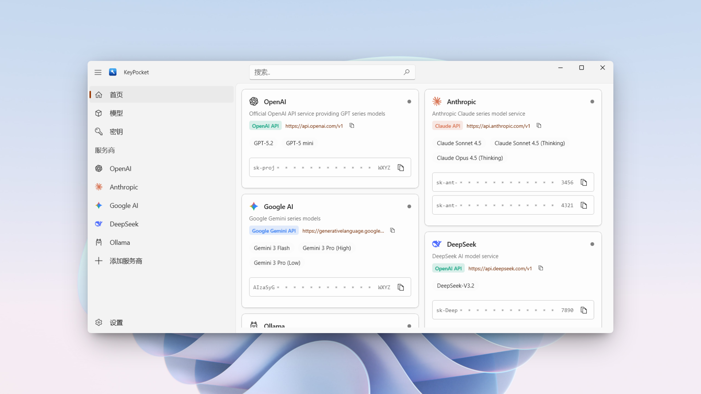



  
  <a href="../README.md">English</a> | <strong>简体中文</strong> | <a href="./README_zh-TW.md">繁體中文</a>

  

  

  

  

KeyPocket 是一个运行在 Windows 平台上的轻量级 API 配置管理工具，用于集中管理多个 AI 服务所需的配置信息。

在使用不同 AI 服务时，通常需要反复填写 Base URL、Model ID 和 API Key 等配置。
KeyPocket 提供一个统一的界面，用于整理不同服务商的相关配置，并支持在需要时快速复制，从而减少在网页、控制台或文档之间来回查找配置的过程。

KeyPocket 主要用于本地开发和调试场景，适合个人开发者管理多个 AI 服务配置。

> [!CAUTION]
> KeyPocket 使用 Windows DPAPI 对 API Key 进行加密存储，但它并不是一个专业的密钥或密码管理软件。
>
> 如果你对密钥的保存安全性有较高要求（包括但不限于高敏感度或长期存储的凭据），请使用专业的密码管理器或密钥管理解决方案。

## 界面预览

  

  

## 功能特性

* 集中管理：在一个地方管理多平台配置（OpenAI, Claude, Ollama 等）。
* 开发就绪：一键复制 API Key 和服务端点 (Endpoints)。
* 原生体验：基于 WinUI 3 和 .NET 10 构建，提供现代化的 Windows 10 / 11 外观和手感。

## 安全与隐私

鉴于本应用处理敏感的 API 密钥，我们非常重视数据处理的透明度：

* 本地优先：所有数据均经过加密并仅存储在您的本地设备上（`AppData` 文件夹）。任何数据都不会上传至云端服务器。
* 无遥测：我们不会追踪您如何使用密钥。
* 开源透明：代码完全开源。如果您对安全性有顾虑，我们强烈建议您通过源码自行构建（见下方构建说明），以确保完全的透明度。

> 免责声明：本软件按“原样”提供，不包含任何形式的明示或暗示担保。尽管我们要实施了本地加密措施来保护您的数据，但您仍需对
> API 密钥的安全负最终责任。

## 安装

### 选项 1：从源码构建（推荐）

为了确保最高级别的安全性与透明度，**我们强烈建议您从源码自行构建 KeyPocket**。这让您能够审查代码，并确保您清楚地知道运行在您设备上的代码究竟是什么。

[查看详细构建说明](./Building.md)

*(需要安装了 Windows App SDK 工作负载的 Visual Studio 2026)*

### 选项 2：微软商店

如果您没有开发环境，或者只是希望快速安装并享受自动更新的便利，您也可以从微软商店下载已打包的版本：

  

> [!IMPORTANT]
> **安全提示：请认准官方渠道**
>
> 我们目前**仅**在 **Microsoft Store** 和本仓库的 **GitHub Releases** 发布 KeyPocket。
>
> 请**不要**信任任何第三方软件下载站提供的安装包。来自非官方来源的版本可能已被篡改或包含恶意软件。

## 贡献

欢迎任何形式的贡献！

在提交 Pull Request 之前，请务必阅读 [贡献指南](./CONTRIBUTING.md)。

感谢每一位为 KeyPocket 做出贡献的人！

## 许可证

本项目采用 MIT 许可证。详情请参阅 [LICENSE](../LICENSE) 文件。