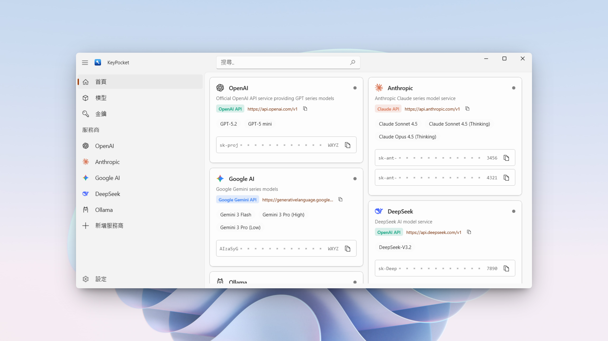



  
  <a href="../README.md">English</a> | <a href="./README_zh-CN.md">简体中文</a> | <strong>繁體中文</strong>

  

  

  

  

KeyPocket 是一個運行在 Windows 平台上的輕量級 API 設定管理工具，用於集中管理多個 AI 服務所需的設定資訊。

在使用不同 AI 服務時，通常需要反覆填寫 Base URL、Model ID 和 API Key 等設定。
KeyPocket 提供一個統一的介面，用於整理不同服務商的相關設定，並支援在需要時快速複製，從而減少在網頁、控制台或文件之間來回尋找設定的過程。

KeyPocket 主要用於本機開發和除錯場景，適合個人開發者管理多個 AI 服務設定。

> [!CAUTION]
> KeyPocket 使用 Windows DPAPI 對 API Key 進行加密儲存，但它並不是一個專業的金鑰或密碼管理軟體。
>
> 如果您對金鑰的保存安全性有較高要求（包括但不限於高敏感度或長期儲存的憑證），請使用專業的密碼管理器或金鑰管理解決方案。

## 介面預覽

  

  

## 功能特性

* 集中管理：在一個地方管理多平台設定（OpenAI, Claude, Ollama 等）。
* 開發就緒：一鍵複製 API Key 和服務端點 (Endpoints)。
* 原生體驗：基於 WinUI 3 和 .NET 10 構建，提供現代化的 Windows 10 / 11 外觀和手感。

## 安全與隱私

鑑於本應用程式處理敏感的 API 金鑰，我們非常重視資料處理的透明度：

* 本機優先：所有資料均經過加密並僅儲存在您的本機裝置上（`AppData` 資料夾）。任何資料都不會上傳至雲端伺服器。
* 無遙測：我們不會追蹤您如何使用金鑰。
* 開源透明：程式碼完全開源。如果您對安全性有疑慮，我們強烈建議您透過原始碼自行建置（見下方建置說明），以確保完全的透明度。

> 免責聲明：本軟體按「原樣」提供，不包含任何形式的明示或暗示擔保。儘管我們要實施了本機加密措施來保護您的資料，但您仍需對
> API 金鑰的安全負最終責任。

## 安裝

### 選項 1：從原始碼建置（推薦）

為了確保最高級別的安全性與透明度，**我們強烈建議您從原始碼自行建置 KeyPocket**。這讓您能夠審查程式碼，並確保您清楚地知道運行在您裝置上的程式碼究竟是什麼。

[查看詳細建置說明](./Building.md)

*(需要安裝了 Windows App SDK 工作負載的 Visual Studio 2026)*

### 選項 2：微軟商店

如果您沒有開發環境，或者只是希望快速安裝並享受自動更新的便利，您也可以從微軟商店下載已打包的版本：

  

> [!IMPORTANT]
> 安全提示：
>
> 我們目前**僅**在 **Microsoft Store** 和本倉庫的 **GitHub Releases** 發布 KeyPocket。
>
> 請**不要**信任任何第三方軟體下載站提供的安裝檔。來自非官方來源的版本可能已被篡改或包含惡意軟體。

## 貢獻

歡迎任何形式的貢獻！

在提交 Pull Request 之前，請務必閱讀 [貢獻指南](./CONTRIBUTING.md)。

感謝每一位為 KeyPocket 做出貢獻的人！

## 授權

本專案採用 MIT 授權。詳情請參閱 [LICENSE](../LICENSE) 文件。