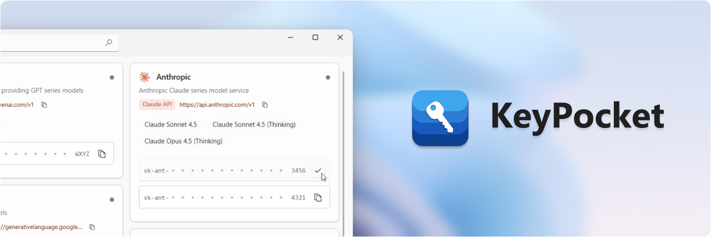
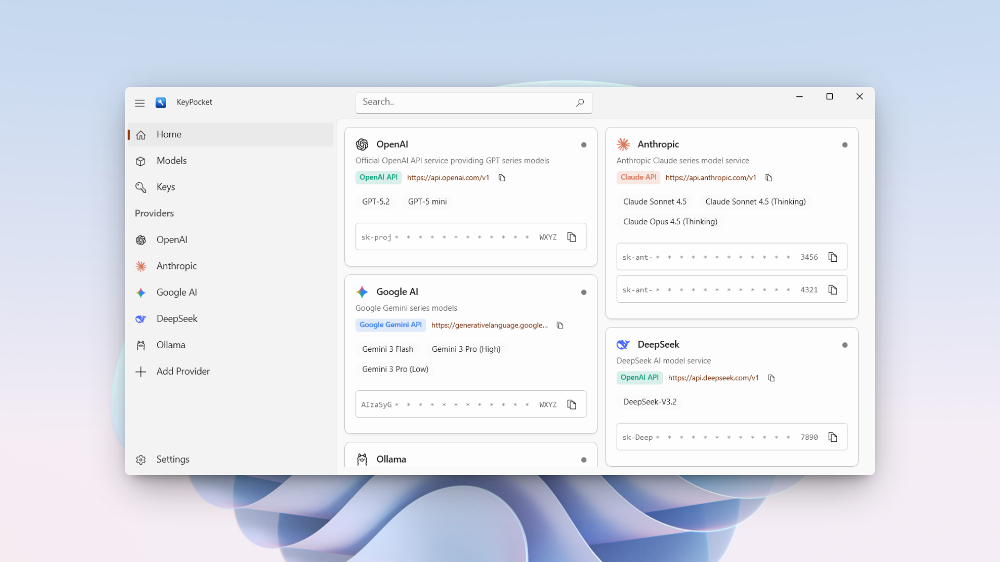
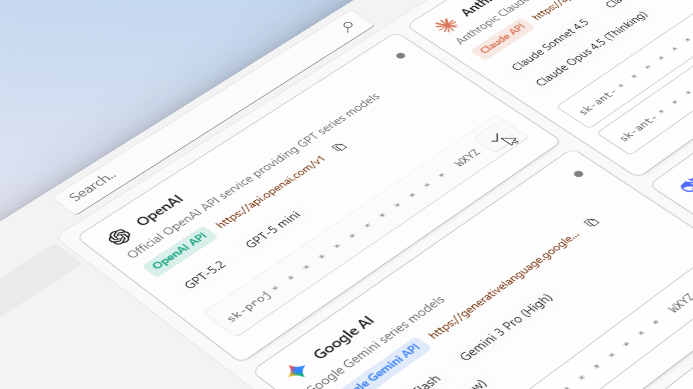

  
  <strong>English</strong> | <a href="./Docs/README_zh-CN.md">简体中文</a> | <a href="./Docs/README_zh-TW.md">繁體中文</a>

  

  

  

  

KeyPocket is a lightweight API configuration management tool running on Windows, designed to centrally manage
configuration information required by multiple AI services.

When using different AI services, it is often necessary to repeatedly fill in configurations such as Base URL, Model ID,
and API Key.
KeyPocket provides a unified interface to organize configurations from different providers and supports quick copying
when needed, thereby reducing the process of searching back and forth between web pages, consoles, or documentation.

KeyPocket is primarily used for local development and debugging scenarios, suitable for individual developers managing
multiple AI service configurations.

> [!CAUTION]
> KeyPocket uses Windows DPAPI to encrypt and store API Keys, but it is not a professional key or password management
> software.
>
> If you have high security requirements for key storage (including but not limited to highly sensitive or long-term
> stored credentials), please use a professional password manager or key management solution.

## Screenshots

  

  

## Features

* Centralized Hub: Manage multi-platform configurations (OpenAI, Claude, Ollama, etc.) in one place.
* Development Ready: Copy API Keys and Endpoints with a single click.
* Native Experience: Built with WinUI 3 and .NET 10, offering a modern Windows 10 / 11 look and feel.

## Security & Privacy

Since this application handles sensitive API Keys, we value transparency regarding how your data is handled:

* Local First: All data is encrypted and stored locally on your device (`AppData` folder). No data is ever uploaded
  to any cloud server.
* No Telemetry: We do not track how you use your keys.
* Open Source: The code is fully open-source. If you have security concerns, we highly recommend building from
  source (see building from source below) to ensure full transparency.

> Disclaimer: The software is provided "as is", without warranty of any kind, express or implied. While we implement
> local encryption to protect your data, you are ultimately responsible for keeping your API keys safe.

## Installing

### Option 1: Build from Source (Recommended)

For the highest level of security transparency, **we strongly recommend building KeyPocket from source**. This allows
you to audit the code and ensure exactly what is running on your device.

[View Detailed Build Instructions](./Docs/Building.md)

*(Requires Visual Studio 2026 with Windows App SDK workload)*

### Option 2: Microsoft Store

If you do not have a development environment or simply prefer a quick, ready-to-use installation with automatic updates,
you can download the packaged version from the Microsoft Store:

  

## Contributing

Contributions are welcome!

Please make sure to read the [Contributing Guide](./Docs/CONTRIBUTING.md) before making a pull request.

Thank you to everyone contributing to KeyPocket!

## License

This project is licensed under the MIT License. See the [LICENSE](LICENSE) file for details.